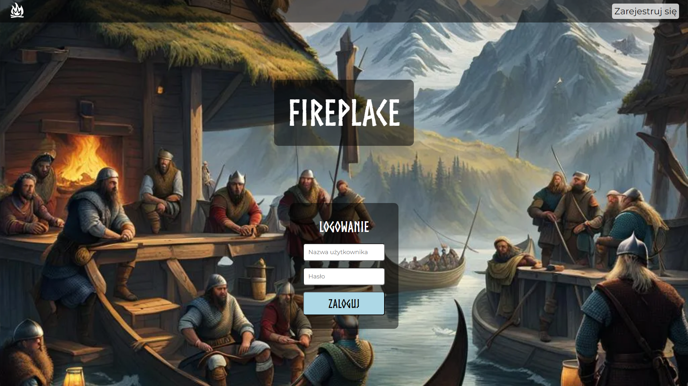
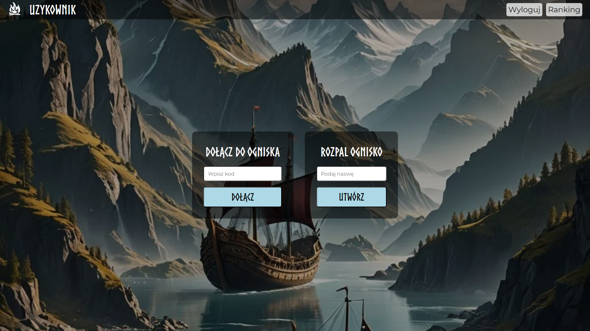
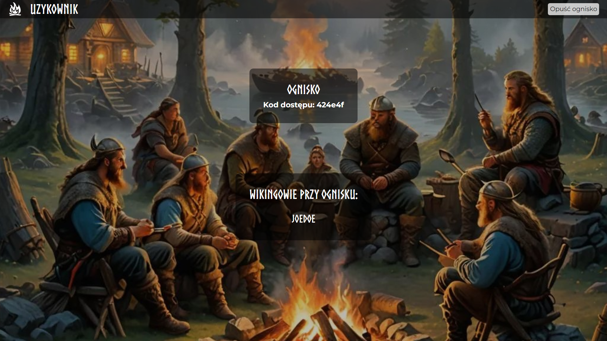

<h1 align="center">TBH Creatures</h1>

## Projekt Hacknarok

### Opis projektu

Aplikacja stworzona z myślą o pomaganiu użytkownikom w utrzymywaniu skupienia podczas wykonywania zadań. Utrzymana w klimacie nordyckim, pozwala przenieść się do świata wikingów, gdzie zasiadając przy wspólnym ognisku wojownicy mogą w pełni poświęcić się planowaniu bitew, nie rozpraszając się mediami społecznościowymi.

### Instrukcja użytkowania
#### Strona logowania i rejestracji

Strona główna umożliwia uzytkownikom założenie własnego konta w oparciu o nazwę użytkownika i hasło. Użytkownikom już posiadającym konto, aplikacja umożliwia logowanie z wykorzystaniem zarejestrowanych danych.

<p align="center">
    
</p>

<p align="center">
    
</p>

#### Strona główna

Po zalogowaniu do swojego konta, użytkownik ma możliwość stworzenia nowego spotkania (ogniska), lub dołączenia do już istniejącego ogniska. 

<p align="center">
    
</p>

#### Ranking
W oknie głównym dostępny jest również ranking. Zawiera on informacje z nazwą użytkownia, punktami przyznawanymi za odwiedziny przy ognisku, oraz ilością wizyt.

#### Rozpal ognisko
Do utworzenia, potrzebne jest podanie jego nazwy. Będzie ona później widoczna w oknie ogniska.\
Po rozpaleniu ogniska, użytkownik hostujący przenoszony jest do jego okna.

<p align="center">
    
</p>

Osoba tworząca ognisko widzi kod dostępu do ogniska, którego inni użytkownicy będą potrzebować, aby do niego dołączyć. Widoczna jest również lista osób uczestniczących w spotkaniu. W przypadku, kiedy członek spotkania zminimalizuje okno ogniska, jego nazwa podświetlni się na czerwono.

<p align="center">
    
</p>

### Instrukcja uruchomienia
1. Sklonuj repozytorium
```bash
git clone https://github.com/N0wakowsky/hacknarok
cd hacknarok
```

2. Zainstaluj zależności używając poetry lub pip
```bash
poetry install
poetry shell
```
```bash
pip install Flask
```

3. Uruchom serwer w środowisku lokalnym
```bash
flask --app main run
```

4. W środowisku lokalnym wejdź do aplikacji poprzez przeglądarkę internetową. Znajduje się pod adresem [localhost:5000](localhost:5000)